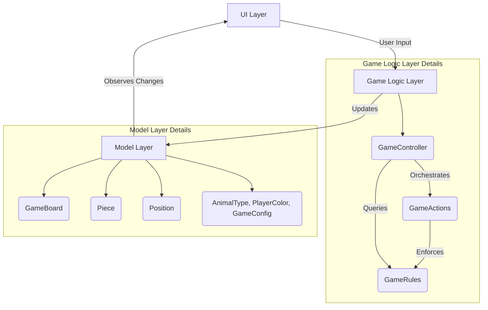

# Animal Chess (鬥獸棋)

A Flutter implementation of the classic Chinese board game Animal Chess (Dou Shou Qi).

## Game Overview

Animal Chess is a strategic board game for two players where each player commands a group of animals with different ranks. The objective is to be the first to move any of your pieces into the opponent's den (cave) or to capture all of your opponent's pieces.

## Game Rules

- 2 players, green and red. The game begins with red's turn

### Board Layout
- The game board is portrait orientation
- 7 columns × 9 rows board
- Green player on top, red player on bottom
- Two dens (caves) - one for each player at opposite ends
- Six traps - three for each player, adjacent to their den
- Two rivers - each river is 2 columns by 3 rows

### Pieces and Hierarchy
Each player has 8 pieces ranked from strongest to weakest:
1. Elephant (象)
2. Lion (獅)
3. Tiger (虎)
4. Leopard (豹)
5. Wolf (狼)
6. Dog (狗)
7. Cat (貓)
8. Rat (鼠)

### Movement Rules
- Pieces move one space orthogonally (up, down, left, or right)
- Pieces cannot move into their own den
- Only the Rat can enter the river
- The Lion and Tiger can jump over the river both horizontally and vertically, but cannot jump if a Rat is in the river
- Pieces in traps can be captured by any opponent piece

### Capture Rules
- A piece can capture an opponent's piece if it is of equal or lower rank
- Exception: The Rat can capture the Elephant, and the Elephant can capture the Rat
- Any piece can capture an opponent's piece in a trap

## Game Variants

The game includes several optional rule variants:

1. **Rat-Only Den Entry**: Only the Rat can enter the opponent's den to win
2. **Extended Lion/Tiger Jumps**:
   - Lion can jump over both rivers (double river jump)
   - Tiger can jump over a single river (single river jump)
   - Leopard can cross rivers horizontally
3. **Dog River Variant**:
   - Dog can enter the river
   - Only the Dog can capture pieces on the shore from within the river
4. **Rat cannot capture Elephant**

## Game Features

- **Timed Gameplay**: Configurable time limit for each player move.
- **Force Pass**: When time expires, play automatically passes to the other player
- **Timer Reset**: Player timer resets when a move is completed
- **Game Instructions**: In-game rules reference available at any time
- **Responsive Design**: Works on both mobile and desktop platforms

## Code Structure Analysis

The project follows a well-organized Flutter architecture with a clear separation of concerns:

### Key Components

1. **Game Logic Layer** (`lib/game/`):
   - `GameController`: Coordinates the overall game state and interactions between components
   - `GameActions`: Implements game actions like moving pieces and switching players
   - `GameRules`: Validates moves according to game rules (now using pluggable variant system)

2. **Model Layer** (`lib/models/`):
   - Data classes representing core game concepts (Piece, Board, Position, etc.)
   - Game configuration options for variants

3. **UI Layer** (`lib/screens/` and `lib/widgets/`):
   - Screens for different app views (main menu, game screen)
   - Reusable widgets for game components (board, pieces, dialogs)

### Code Quality Assessment

The codebase demonstrates several good practices:
- Clear separation of concerns between game logic, data models, and UI
- Comprehensive test coverage with unit tests for game rules and variants
- Internationalization support with multiple languages
- Responsive design that works on different screen sizes
- Well-documented code with comments explaining complex logic

## Possible Improvements

### 1. Game Logic Enhancements
- **Game History**: Implement move history to allow undo/redo functionality
- **AI Opponent**: Add a computer player with different difficulty levels

### 2. UI/UX Improvements
- **Animations**: Add smooth animations for piece movements and captures
- **Accessibility**: Improve accessibility with better contrast and screen reader support
- **Customization**: Allow users to customize the board and piece appearance

### 3. Performance Optimizations
- **Board Rendering**: Optimize the game board rendering for better performance with large boards
- **Memory Management**: Implement better memory management for long gameplay sessions

### 4. Testing and Quality
- **Integration Tests**: Add integration tests for the complete game flow
- **UI Tests**: Implement widget tests for all UI components
- **Code Coverage**: Increase test coverage for edge cases and error conditions

### 5. Documentation
- **API Documentation**: Add comprehensive API documentation for all public methods
- **Architecture Diagram**: Create visual diagrams showing the app architecture and data flow
- **Contributing Guide**: Expand the contributing guidelines with coding standards and practices

### 6. DevOps and Deployment
- **CI/CD Pipeline**: Enhance the GitHub Actions workflow with automated testing and deployment
- **Release Management**: Implement a release management strategy with versioning and changelogs
- **Analytics**: Add analytics to track user engagement and game statistics

### 7. Code Structure Improvements
- **Error Handling**: Implement more robust error handling throughout the application

## Architecture Diagram

This section elaborates on the interaction flow between the layers and lists additional significant UI components.

### Interaction Flow:

1.  **UI Layer (`lib/screens/` and `lib/widgets/`)**:
    *   Users interact with the `AnimalChessGameScreen` and `MainMenuScreen`.
    *   Widgets like `GameBoardWidget`, `PieceWidget`, `SettingsDialogWidget`, etc., render the game state and capture user input.
    *   User actions (e.g., moving a piece, changing settings) are typically passed to the `GameController` in the Game Logic Layer.

2.  **Game Logic Layer (`lib/game/`)**:
    *   The `GameController` receives user input from the UI.
    *   It orchestrates game actions by calling methods in `GameActions` (e.g., `movePiece`, `switchPlayer`).
    *   `GameRules` is used by `GameActions` and `GameController` to validate moves and enforce game rules based on the current `GameBoard` state.
    *   The `GameController` updates the `GameBoard` and `Piece` models in the Model Layer, which in turn triggers UI updates.

3.  **Model Layer (`lib/models/`)**:
    *   Contains the data structures representing the game state (`GameBoard`, `Piece`, `Position`, `AnimalType`, `GameConfig`, `PlayerColor`).
    *   These models are manipulated by the Game Logic Layer.
    *   Changes in the Model Layer are observed by the UI Layer to reflect the updated game state.

### Additional UI Components (`lib/widgets/`):

Based on the provided file list, the `lib/widgets/` directory contains:
*   `about_dialog_widget.dart`
*   `game_board_widget.dart`
*   `game_rules_dialog_widget.dart`
*   `piece_widget.dart`
*   `pieces_rank_list_widget.dart`
*   `player_indicator_widget.dart`
*   `settings_dialog_widget.dart`
*   `variants_dialog_widget.dart`

All of these were already explicitly mentioned in the `GEMINI.md` under "Other UI components". There are no other significant UI components to add from the provided directory listing.

### Architecture Diagram:                                                                                            │



### Project Structure Diagram:

```mermaid
directory
lib
├── main.dart
├── constants
│   ├── board_constants.dart
│   ├── game_constants.dart
│   └── ui_constants.dart
├── core
│   └── service_locator.dart
├── game
│   ├── game_actions.dart
│   ├── game_controller.dart
│   ├── game_rules.dart
│   └── rules
│       ├── game_rule_variant.dart
│       ├── standard_game_rule_variant.dart
│       ├── game_rule_factory.dart
│       └── variants
│           ├── dog_river_variant.dart
│           ├── rat_capture_variant.dart
│           ├── extended_jump_variant.dart
│           └── example_new_variant.dart
├── generated
│   ├── l10n.dart
│   └── intl
├── l10n
│   ├── app_de.arb
│   ├── app_en.arb
│   ├── app_es.arb
│   ├── app_fr.arb
│   ├── app_ja.arb
│   ├── app_ko.arb
│   ├── app_pt.arb
│   ├── app_th.arb
│   ├── app_zh_TW.arb
│   └── app_zh.arb
├── models
│   ├── animal_type.dart
│   ├── game_board.dart
│   ├── game_config.dart
│   ├── piece.dart
│   ├── player_color.dart
│   └── position.dart
├── screens
│   ├── animal_chess_game_screen.dart
│   └── main_menu_screen.dart
└── widgets
    ├── about_dialog_widget.dart
    ├── game_board_widget.dart
    ├── game_rules_dialog_widget.dart
    ├── piece_widget.dart
    ├── pieces_rank_list_widget.dart
    ├── player_indicator_widget.dart
    ├── settings_dialog_widget.dart
    └── variants_dialog_widget.dart
```

Key Components and Interaction:

1.  **UI Layer** (`lib/screens/` and `lib/widgets/`):
    *   Presents the game to the user and captures input.
    *   Screens (e.g., `AnimalChessGameScreen`, `MainMenuScreen`) serve as top-level views.
    *   Widgets (e.g., `GameBoardWidget`, `PieceWidget`, various dialogs) are reusable UI components that display game elements and handle specific interactions.
    *   User actions are dispatched to the Game Logic Layer.

2.  **Game Logic Layer** (`lib/game/`):
    *   `GameController`: The central orchestrator. It receives user input from the UI, processes game events, and updates the game state. It acts as the bridge between the UI and the core game rules/actions.
    *   `GameActions`: Implements the specific operations that change the game state (e.g., `movePiece`, `capture`, `switchTurns`). These actions are invoked by the `GameController`.
    *   `GameRules`: Encapsulates all the rules of Animal Chess. `GameActions` and `GameController` query `GameRules` to validate moves, check for win conditions, and ensure adherence to game mechanics.

3.  **Model Layer** (`lib/models/`):
    *   Defines the data structures that represent the game's state and entities.
    *   `GameBoard`: Represents the current layout of pieces on the board.
    *   `Piece`: Represents an individual animal piece with its type, rank, and owner.
    *   `Position`: Represents coordinates on the game board.
    *   `AnimalType`, `PlayerColor`, `GameConfig`: Enums and data classes defining game constants and configurable options.
    *   The Game Logic Layer modifies these models, and the UI Layer observes these changes to re-render the game.

This structure ensures a clear separation of concerns, making the codebase modular, testable, and maintainable.

## Refactor and Redesign Changes

### Pluggable Game Rule Variants System

The game rules system has been refactored to support a pluggable variant architecture using the Decorator pattern. This makes it much easier to add new variants without modifying existing code.

#### New Architecture Components:

1. **GameRuleVariant Interface** (`lib/game/rules/game_rule_variant.dart`):
   - Defines the contract for all rule variants
   - Methods for checking river entry, capture rules, river jumps, and den movement

2. **StandardGameRuleVariant** (`lib/game/rules/standard_game_rule_variant.dart`):
   - Implements the core game rules without any variants
   - Serves as the base for all other variants

3. **Individual Variant Implementations** (`lib/game/rules/variants/`):
   - `DogRiverVariant`: Dogs can enter rivers
   - `RatCaptureVariant`: Rats cannot capture elephants
   - `ExtendedJumpVariant`: Extended lion/tiger jumps and leopard river crossing
   - `ExampleNewVariant`: Example implementation for adding new variants

4. **GameRuleFactory** (`lib/game/rules/game_rule_factory.dart`):
   - Creates composed rule variants based on game configuration
   - Uses the decorator pattern to stack variants

5. **Updated GameRules** (`lib/game/game_rules.dart`):
   - Now delegates to the pluggable variant system
   - Maintains backward compatibility

#### Benefits of the New System:

- **Extensibility**: New variants can be easily added by implementing the GameRuleVariant interface
- **Composability**: Multiple variants can be combined seamlessly
- **Maintainability**: Each variant is isolated in its own class
- **Testability**: Variants can be tested independently
- **Backward Compatibility**: Existing code continues to work without changes

#### How to Add New Variants:

1. Create a new class that implements GameRuleVariant
2. Implement the required methods, delegating to the base variant for unchanged rules
3. Add the new variant to the GameRuleFactory
4. The new variant is now automatically available when enabled through GameConfig

This refactor significantly improves the codebase's flexibility for adding new game variants while maintaining clean separation of concerns.
