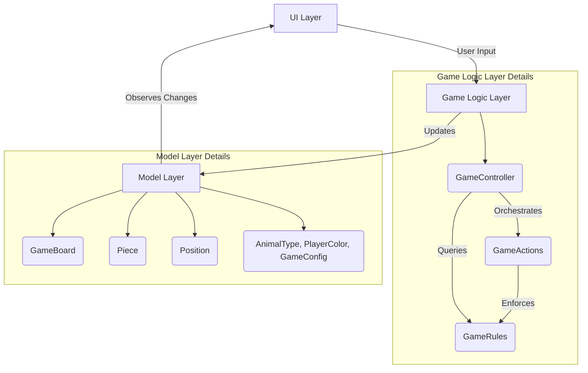

# Animal Chess (鬥獸棋) - Application Design Document

A Flutter implementation of the classic Chinese board game Animal Chess (Dou Shou Qi).

## 1. Game Overview

Animal Chess is a strategic board game for two players where each player commands a group of animals with different ranks. The objective is to be the first to move any of your pieces into the opponent's den (cave) or to capture all of your opponent's pieces.

### 1.1 Game Rules

- 2 players, green and red. The game begins with red's turn

#### Board Layout
- The game board is portrait orientation
- 7 columns × 9 rows board
- Green player on top, red player on bottom
- Two dens (caves) - one for each player at opposite ends
- Six traps - three for each player, adjacent to their den
- Two rivers - each river is 2 columns by 3 rows

#### Pieces and Hierarchy
Each player has 8 pieces ranked from strongest to weakest:
1. Elephant (象)
2. Lion (獅)
3. Tiger (虎)
4. Leopard (豹)
5. Wolf (狼)
6. Dog (狗)
7. Cat (貓)
8. Rat (鼠)

#### Movement Rules
- Pieces move one space orthogonally (up, down, left, or right)
- Pieces cannot move into their own den
- Only the Rat can enter the river
- The Lion and Tiger can jump over the river both horizontally and vertically, but cannot jump if a Rat is in the river
- Pieces in traps can be captured by any opponent piece

#### Capture Rules
- A piece can capture an opponent's piece if it is of equal or lower rank
- Exception: The Rat can capture the Elephant, and the Elephant can capture the Rat
- Any piece can capture an opponent's piece in a trap

### 1.2 Game Variants

The game includes several optional rule variants:

1. **Rat-Only Den Entry**: Only the Rat can enter the opponent's den to win
2. **Extended Lion/Tiger Jumps**:
   - Lion can jump over both rivers (double river jump)
   - Tiger can jump over a single river (single river jump)
   - Leopard can cross rivers horizontally
3. **Dog River Variant**:
   - Dog can enter the river
   - Only the Dog can capture pieces on the shore from within the river
4. **Rat cannot capture Elephant**

### 1.3 Game Features

- **Timed Gameplay**: Configurable time limit for each player move.
- **Force Pass**: When time expires, play automatically passes to the other player
- **Timer Reset**: Player timer resets when a move is completed
- **Game Instructions**: In-game rules reference available at any time
- **Responsive Design**: Works on both mobile and desktop platforms
- **AI Opponent**: Computer players with configurable difficulty
- **AI Move Visualization**: Visual indication of AI moves with configurable delays
- **AI vs AI Mode**: Watch two AI players compete against each other
- **Configurable AI Settings**: Choose which players are controlled by AI (green, red, or both)

## 2. System Architecture

The application follows a clean architecture pattern with clear separation of concerns between different layers.

### 2.1 High-Level Architecture



### 2.2 Layered Architecture

#### 2.2.1 UI Layer (`lib/screens/` and `lib/widgets/`)
- **Purpose**: Presents the game to the user and captures input
- **Screens**: 
  - `AnimalChessGameScreen`: Main game screen
  - `MainMenuScreen`: Application entry point
- **Widgets**:
  - `GameBoardWidget`: Renders the game board
  - `PieceWidget`: Renders individual pieces
  - Dialog widgets for settings, rules, about, victory, and variants
  - `PlayerIndicatorWidget`: Shows current player
  - `PiecesRankListWidget`: Displays piece rankings
- **Responsibilities**:
  - Render game state visually
  - Capture user interactions
  - Dispatch actions to Game Logic Layer

#### 2.2.2 Game Logic Layer (`lib/game/`)
- **Purpose**: Implements game rules, state management, and business logic
- **Components**:
  - `GameController`: Central orchestrator that coordinates game flow
  - `GameActions`: Implements specific game operations (move piece, switch player, etc.)
  - `GameRules`: Validates moves and enforces game rules (using pluggable variant system)
- **Responsibilities**:
  - Process user input from UI
  - Validate moves according to game rules
  - Update game state
  - Manage game flow and transitions

#### 2.2.3 Model Layer (`lib/models/`)
- **Purpose**: Defines data structures representing game entities and state
- **Components**:
  - `GameBoard`: Represents the current layout of pieces
  - `Piece`: Represents an individual animal piece
  - `Position`: Represents coordinates on the board
  - `AnimalType`, `PlayerColor`: Enums for game constants
  - `GameConfig`: Configuration options for game variants
- **Responsibilities**:
  - Store and manage game state
  - Provide data access methods
  - Notify observers of state changes

#### 2.2.4 Core Layer (`lib/core/`)
- **Purpose**: Provides infrastructure services and dependency injection
- **Components**:
  - `service_locator.dart`: Dependency injection container using GetIt
- **Responsibilities**:
  - Manage object lifecycle
  - Provide singletons and factories
  - Decouple components

#### 2.2.5 Constants Layer (`lib/constants/`)
- **Purpose**: Define application-wide constants
- **Components**:
  - `board_constants.dart`: Board dimensions and layout
  - `game_constants.dart`: Game-specific constants
  - `ui_constants.dart`: UI-related constants
- **Responsibilities**:
  - Centralize configuration values
  - Ensure consistency across the application

## 3. Detailed Component Design

### 3.1 Game Rules System (Pluggable Variants)

The game rules system has been refactored to support a pluggable variant architecture using the Decorator pattern.

#### 3.1.1 Architecture Components

1. **GameRuleVariant Interface** (`lib/game/rules/game_rule_variant.dart`):
   - Defines the contract for all rule variants
   - Methods for checking river entry, capture rules, river jumps, and den movement

2. **StandardGameRuleVariant** (`lib/game/rules/standard_game_rule_variant.dart`):
   - Implements the core game rules without any variants
   - Serves as the base for all other variants

3. **Individual Variant Implementations** (`lib/game/rules/variants/`):
   - `DogRiverVariant`: Dogs can enter rivers
   - `RatCaptureVariant`: Rats cannot capture elephants
   - `ExtendedJumpVariant`: Extended lion/tiger jumps and leopard river crossing
   - `ExampleNewVariant`: Example implementation for adding new variants

4. **GameRuleFactory** (`lib/game/rules/game_rule_factory.dart`):
   - Creates composed rule variants based on game configuration
   - Uses the decorator pattern to stack variants

5. **Updated GameRules** (`lib/game/game_rules.dart`):
   - Now delegates to the pluggable variant system
   - Maintains backward compatibility

#### 3.1.2 Benefits of the New System

- **Extensibility**: New variants can be easily added by implementing the GameRuleVariant interface
- **Composability**: Multiple variants can be combined seamlessly
- **Maintainability**: Each variant is isolated in its own class
- **Testability**: Variants can be tested independently
- **Backward Compatibility**: Existing code continues to work without changes

#### 3.1.3 How to Add New Variants

1. Create a new class that implements GameRuleVariant
2. Implement the required methods, delegating to the base variant for unchanged rules
3. Add the new variant to the GameRuleFactory
4. The new variant is now automatically available when enabled through GameConfig

### 3.3 AI Implementation

The game includes a computer AI opponent with the following features:

#### 3.3.1 Components

1. **AIStrategy** (`lib/game/ai_strategy.dart`):
   - Implements the decision-making logic for AI moves
   - Evaluates possible moves and selects the best one based on a simple heuristic

2. **AIMove** (`lib/game/ai_move.dart`):
   - Represents a potential move with a from and to position
   - Includes a score for evaluating move quality

#### 3.3.2 AI Algorithm

The AI uses a simple heuristic-based approach:
- Evaluates all valid moves for the current player
- Assigns scores to moves based on factors like:
  - Capturing opponent pieces (higher-ranked pieces worth more)
  - Moving toward the opponent's den
  - Avoiding capture by opponent pieces
- Selects the move with the highest score

#### 3.3.3 AI Configuration

- AI players can be enabled/disabled for each color (green/red)
- Both players can be controlled by AI for AI vs AI gameplay
- AI moves are executed with a configurable delay for better visualization
- The delay between AI moves can be adjusted in the game controller

#### 3.3.4 AI Execution Flow

1. **AI Detection**: GameController checks if the current player is an AI
2. **Move Calculation**: AIStrategy calculates the best move
3. **Move Execution**: GameController executes the AI move
4. **Delay**: A configurable delay is added between AI moves for visualization
5. **State Update**: Game state is updated and UI is refreshed

#### 3.3.5 AI vs AI Mode

- Special mode where both players are controlled by AI
- Useful for testing and demonstration purposes
- Can be configured through game settings

### 3.4 Game Flow

1. **Initialization**:
   - Application starts with `main.dart`
   - Dependency injection is set up via `service_locator.dart`
   - `MainMenuScreen` is displayed

2. **Game Setup**:
   - User selects game options in settings
   - `GameController` is instantiated with selected configuration
   - Game board is initialized with pieces in starting positions

3. **Game Play**:
   - Players take turns moving pieces
   - `GameController` handles piece selection and movement
   - `GameRules` validates each move
   - `GameActions` executes valid moves and updates state
   - UI updates to reflect new game state

4. **Game End**:
   - Game ends when a player wins (enters opponent's den or captures all pieces)
   - Victory dialog is displayed
   - Players can choose to restart or return to main menu

### 3.5 Data Flow

1. **User Input**:
   - User interacts with UI components (taps on pieces, selects options)
   - UI components dispatch events to `GameController`

2. **Processing**:
   - `GameController` processes events and updates game state
   - `GameRules` validates moves
   - `GameActions` executes game logic

3. **State Update**:
   - Model objects are updated with new state
   - Observers (UI components) are notified of changes

4. **Rendering**:
   - UI components re-render to reflect updated state

## 4. Project Structure

```mermaid
directory
lib
├── main.dart
├── constants
│   ├── board_constants.dart
│   ├── game_constants.dart
│   └── ui_constants.dart
├── core
│   └── service_locator.dart
├── game
│   ├── game_actions.dart
│   ├── game_controller.dart
│   ├── game_rules.dart
│   └── rules
│       ├── game_rule_variant.dart
│       ├── standard_game_rule_variant.dart
│       ├── game_rule_factory.dart
│       └── variants
│           ├── dog_river_variant.dart
│           ├── rat_capture_variant.dart
│           ├── extended_jump_variant.dart
│           └── example_new_variant.dart
├── generated
│   ├── l10n.dart
│   └── intl
├── l10n
│   ├── app_de.arb
│   ├── app_en.arb
│   ├── app_es.arb
│   ├── app_fr.arb
│   ├── app_ja.arb
│   ├── app_ko.arb
│   ├── app_pt.arb
│   ├── app_th.arb
│   ├── app_zh_TW.arb
│   └── app_zh.arb
├── models
│   ├── animal_type.dart
│   ├── game_board.dart
│   ├── game_config.dart
│   ├── piece.dart
│   ├── player_color.dart
│   └── position.dart
├── screens
│   ├── animal_chess_game_screen.dart
│   └── main_menu_screen.dart
└── widgets
    ├── about_dialog_widget.dart
    ├── debug_menu_widget.dart
    ├── game_board_widget.dart
    ├── game_rules_dialog_widget.dart
    ├── piece_widget.dart
    ├── pieces_rank_list_widget.dart
    ├── player_indicator_widget.dart
    ├── settings_dialog_widget.dart
    ├── variants_dialog_widget.dart
    └── victory_dialog_widget.dart
```

## 5. Design Patterns Used

### 5.1 Observer Pattern
- Used for UI updates when game state changes
- Model objects notify UI components of changes

### 5.2 Factory Pattern
- `GameRuleFactory` creates composed rule variants
- `service_locator.dart` provides object creation

### 5.3 Decorator Pattern
- Used in the pluggable variant system
- Allows stacking of multiple variants

### 5.4 Singleton Pattern
- Used for dependency injection via GetIt
- Ensures single instances of key services

### 5.5 State Pattern
- Game state is managed through model objects
- Different game states (playing, ended) are handled explicitly

## 6. Testing Strategy

### 6.1 Unit Tests
- Game rules validation
- Variant implementations
- Model object behavior
- Located in `test/` directory

### 6.2 Widget Tests
- UI component rendering
- User interaction handling
- Dialog behavior

### 6.3 Integration Tests
- Complete game flow
- Interaction between layers

## 7. Internationalization

The application supports multiple languages through Flutter's internationalization system:
- English, Chinese, Spanish, French, Japanese, Korean, Portuguese, Thai, and Traditional Chinese
- ARB files in `lib/l10n/` directory
- Generated code in `lib/generated/` directory

## 8. Performance Considerations

### 8.1 UI Performance
- Efficient widget rebuilding using Flutter's widget system
- Minimal rebuilds through proper state management

### 8.2 Memory Management
- Proper disposal of resources
- Efficient data structures for game state

### 8.3 Game Logic Performance
- Optimized move validation algorithms
- Efficient board representation

## 9. Possible Improvements

### 9.1 Game Logic Enhancements
- **Game History**: Implement move history to allow undo/redo functionality
- **AI Opponent**: Add a computer player with different difficulty levels

### 9.2 UI/UX Improvements
- **Animations**: Add smooth animations for piece movements and captures
- **Accessibility**: Improve accessibility with better contrast and screen reader support
- **Customization**: Allow users to customize the board and piece appearance

### 9.3 Performance Optimizations
- **Board Rendering**: Optimize the game board rendering for better performance with large boards
- **Memory Management**: Implement better memory management for long gameplay sessions

### 9.4 Testing and Quality
- **Integration Tests**: Add integration tests for the complete game flow
- **UI Tests**: Implement widget tests for all UI components
- **Code Coverage**: Increase test coverage for edge cases and error conditions

### 9.5 Documentation
- **API Documentation**: Add comprehensive API documentation for all public methods
- **Architecture Diagram**: Create visual diagrams showing the app architecture and data flow
- **Contributing Guide**: Expand the contributing guidelines with coding standards and practices

### 9.6 DevOps and Deployment
- **CI/CD Pipeline**: Enhance the GitHub Actions workflow with automated testing and deployment
- **Release Management**: Implement a release management strategy with versioning and changelogs
- **Analytics**: Add analytics to track user engagement and game statistics

### 9.7 Code Structure Improvements
- **Error Handling**: Implement more robust error handling throughout the application
